# Lithium-ion Battery Electrical Modeling

The purpose of this project is to model the electrical behavior of a lithium-ion battery initially in cell level so that the model can be afterwards applied for the whole battery pack of the vehicle. A 18650 cell is modeled taking into consideration the temperature, current and SOC variations. For the model implementation a hybrid approach is adopted, where the fast electrochemical processes such as the ohmic and the charge transfer losses are estimated by the Electrochemical Impedance Spectroscopy (EIS) technique, while the slow electrochemical processes such as the diffusion phenomena are modeled by the current pulse method or Hybrid Power Pulse Characterization (HPPC).

A 2-RC with two series resistances equivalent circuit is adopted since this way the battery performance can be modeled without significantly increasing the complexity of the model.

  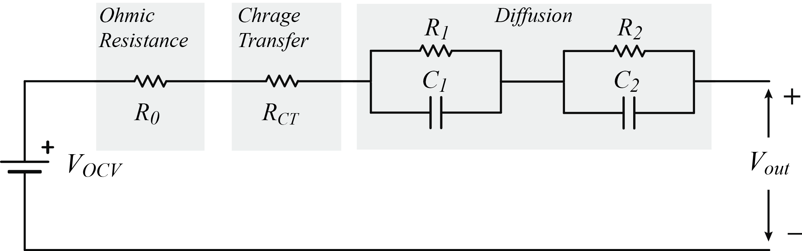

The model is implemented in MATLAB/Simulink environment and some selective function blocks of the model are presented below

  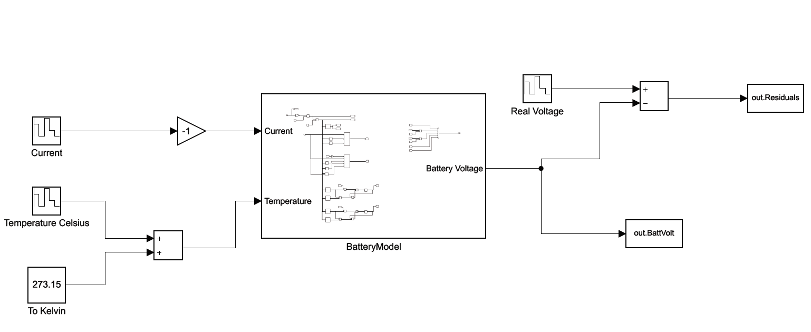

The SOC estimation is based on coulomb counting method and the block is presented below.

  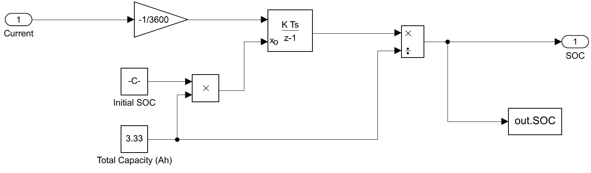

The ohmic resistance R0 and the charge transfer resistance are estimated via EIS depending on the temperature, current and SOC variation and their modeling is shown below.

  

The diffusion phenomena are estimated via HPPC depending on the temperature, current and SOC variation and they are modeled by 2RC branches as shown below.

  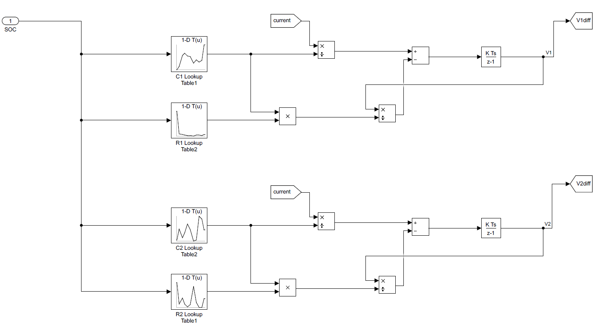

### Experiments

The ohmic and charge transfer resistances are estimated by the EIS for different temperature, current and SOC conditions and the EIS results are presented below.

EIS results vs SOC at 25°C

  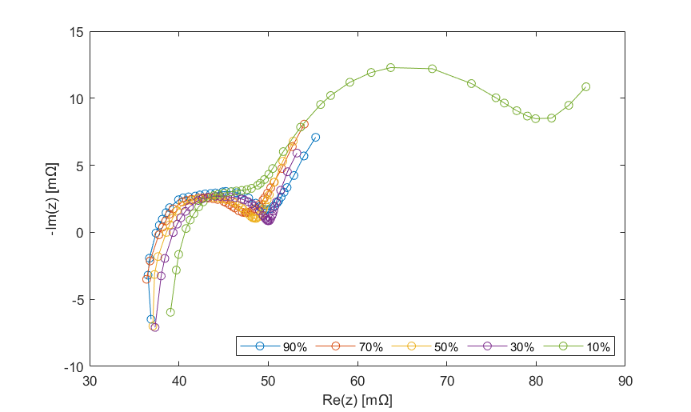

EIS results vs Temperature at 50% SOC

  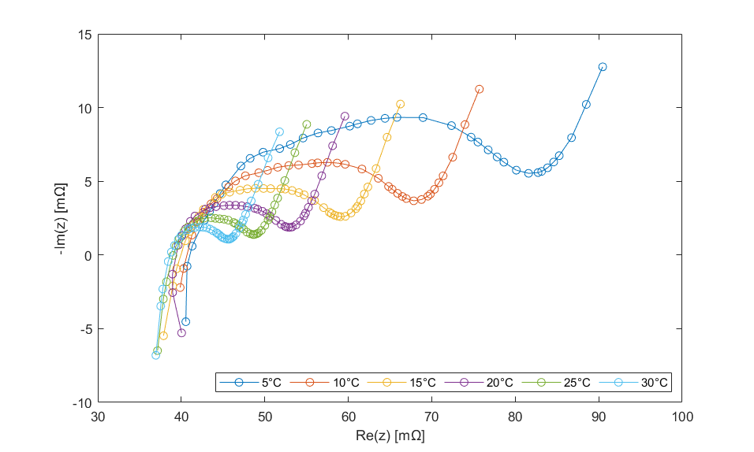

EIS results vs Current at 25°C

  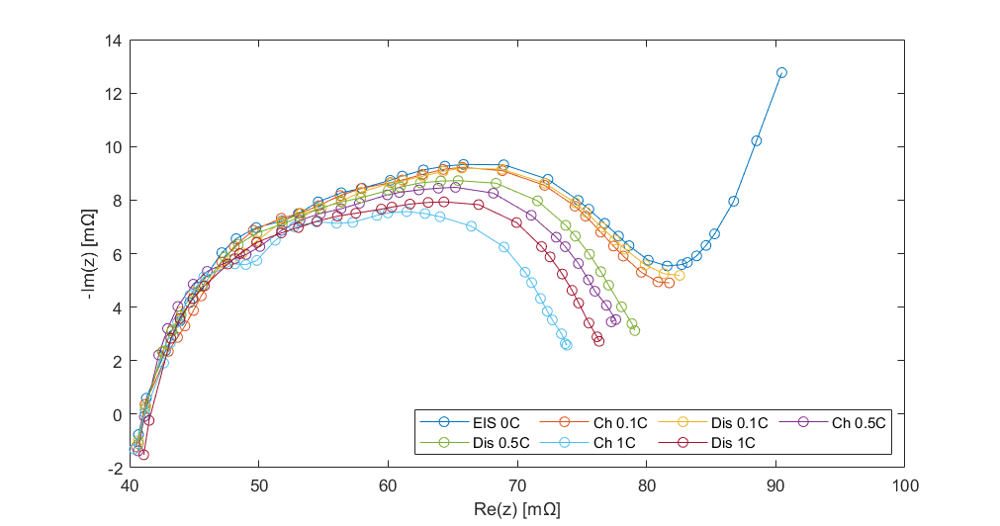

Resistance exported by EIS results vs charging/discharging current

  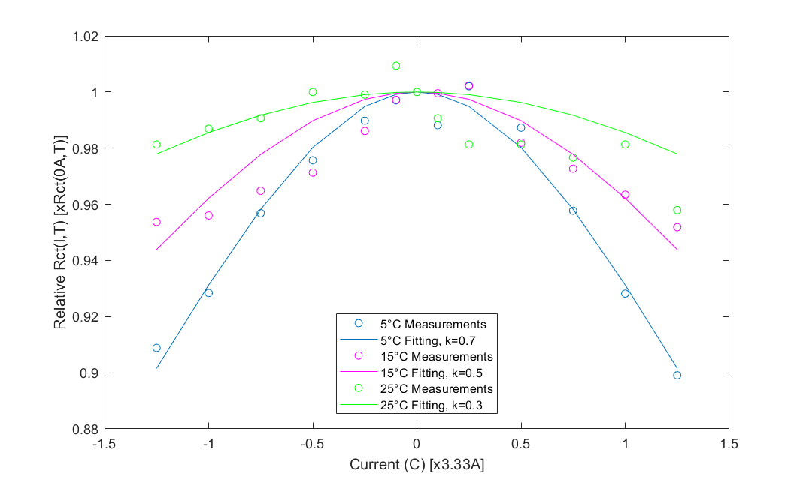

The diffusion phenomena are estimated by the HPPC method for different temperature, current and SOC conditions and the results for the fitting process are presented below.

  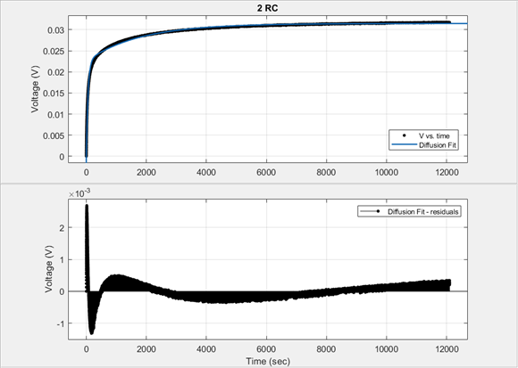

The slow and fast electrochemical processes are combined by the model and they are presented below for the full range of SOC as well as for a discharge pulse. 

  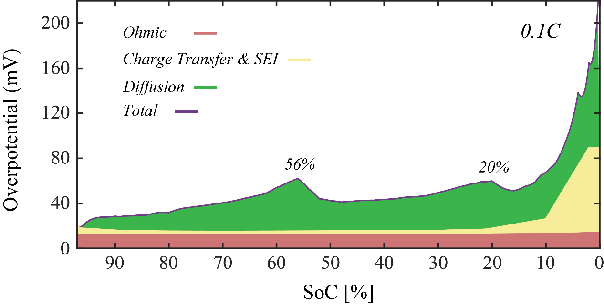

  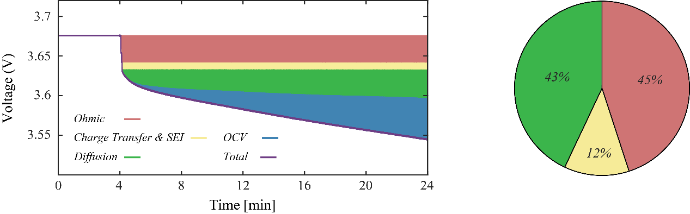

