# Lithium-ion Battery Electrical Modeling

The purpose of this project is to model the electrical behavior of a lithium-ion battery initially in cell level so that the model can be afterwards applied for the whole battery pack of the vehicle. A 18650 cell is modeled taking into consideration the temperature, current and SOC variations. For the model implementation a hybrid approach is adopted, where the fast electrochemical processes such as the ohmic and the charge transfer losses are estimated by the Electrochemical Impedance Spectroscopy (EIS) technique, while the slow electrochemical processes such as the diffusion phenomena are modeled by the current pulse method or Hybrid Power Pulse Characterization (HPPC).

A 2-RC with two series resistances equivalent circuit is adopted since this way the battery performance can be modeled without significantly increasing the complexity of the model.

The model is implemented in MATLAB/Simulink environment and some selective function blocks of the model are presented below

The SOC estimation is based on coulomb counting method and the block is presented below.

The ohmic resistance R0 and the charge transfer resistance are estimated via EIS depending on the temperature, current and SOC variation and their modeling is shown below.

The diffusion phenomena are estimated via HPPC depending on the temperature, current and SOC variation and they are modeled by 2RC branches as shown below.

The ohmic and charge transfer resistances are estimated by the EIS for different temperature, current and SOC conditions and the EIS results are presented below.

EIS results vs SOC at 25°C

EIS results vs Temperature at 50% SOC

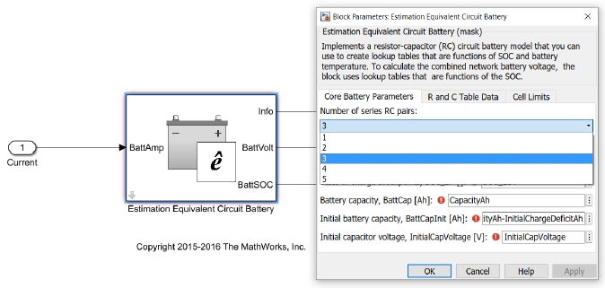
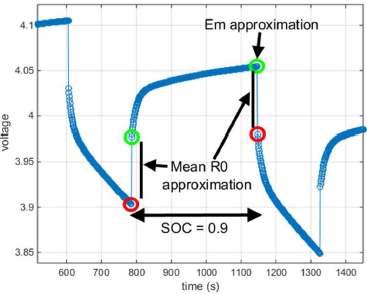
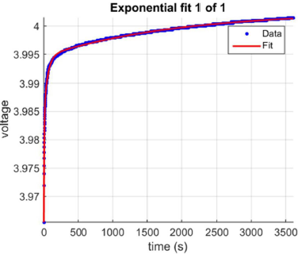

### Experiments

For the first experiments we used cylindrical Li-ion cells (18650). The purpose was to check the function of the experimental topology. Below, it is shown the experimental circuits that we used in order to simulate the cell load and read the voltage values and store them.

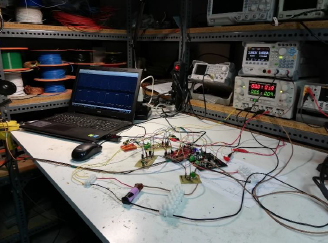

Below, we present the results

Then we used some old battery cells (pouch cells) that our team used in our electric vehicle

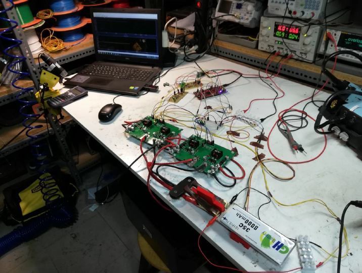

Below, we present the results

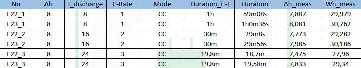

### Modeling

Below, it is presented the simulation voltages in comparison with the real voltages of a battery cell.

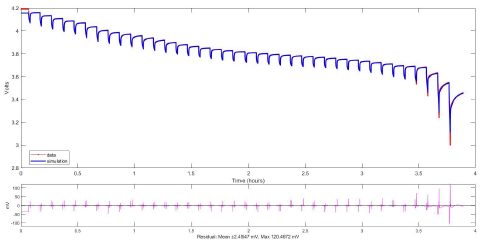
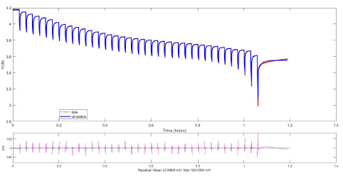

Also, below it is presented the simulation voltages in comparison with the real voltages of a battery cell but now in a more real scenario. Here, the current of the battery cell is the current profile of an Endurance Event (22km track) of the race car.

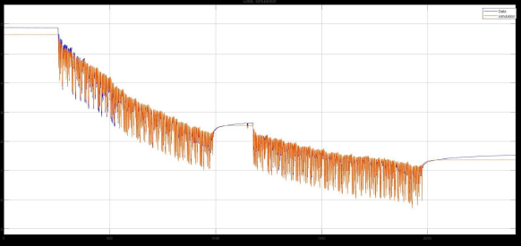
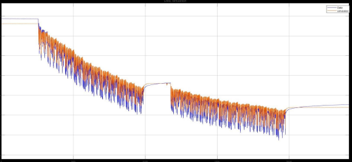
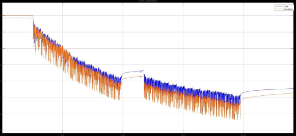
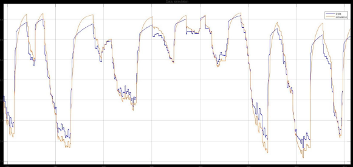
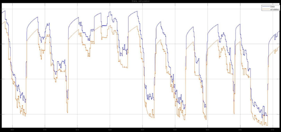
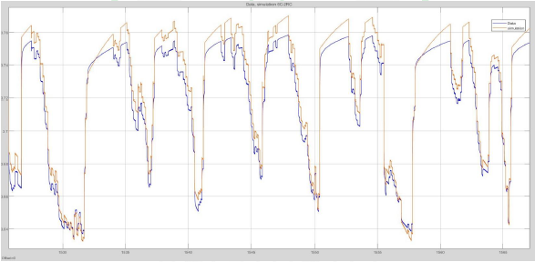
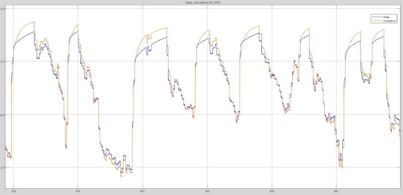

From these diagrams we were able to make some important observations. At first, we saw that the simulation voltages depend a lot by the LUT that we choose. Also, another factor that we ignored for the present moment was the temperature of the cell, which modifies by a lot the internal resistance of the cell and thus its voltage transient response. However, we noticed that the open-circuit voltage, which is subtracted by the voltage drop, is very accurate and depends on the C-Rate of each experiment.

